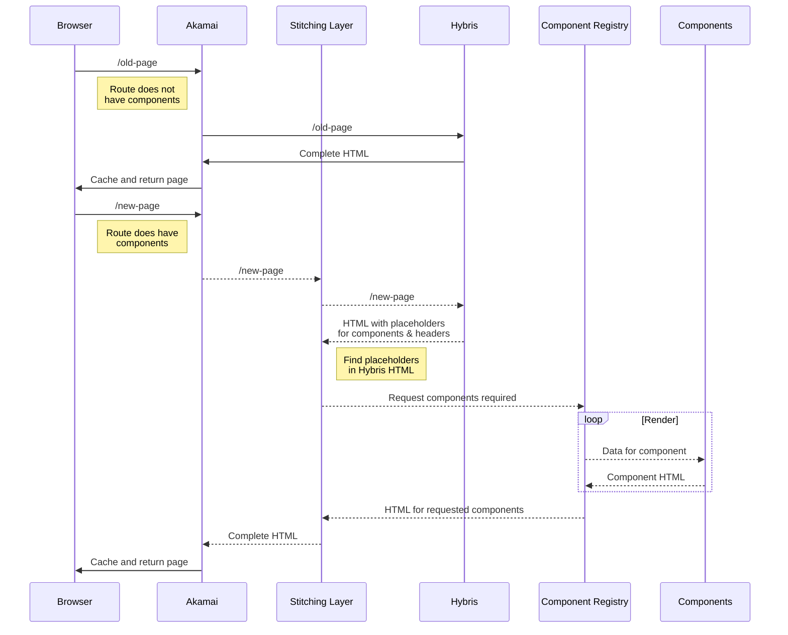

```mermaid
sequenceDiagram
  participant Browser
  participant Akamai
  participant Stitching Layer
  participant Hybris
  participant Component Registry
  participant Components

  Browser->>Akamai: /old-page
  Note left of Akamai: Route does not<br /> have components
  Akamai->>Hybris: /old-page
  Hybris->>Akamai: Complete HTML
  Akamai->>Browser: Cache and return page

  Browser->>Akamai: /new-page
  Note left of Akamai: Route does have<br />  components
  Akamai-->>Stitching Layer: /new-page
  Stitching Layer-->>Hybris: /new-page
  Hybris-->>Stitching Layer: HTML with placeholders <br/> for components & headers
  Note right of Stitching Layer: Find placeholders <br/> in Hybris HTML
  Stitching Layer-->>Component Registry: Request components required
  loop Render
    Component Registry-->>Components: Data for component
    Components-->>Component Registry: Component HTML
  end
  Component Registry-->>Stitching Layer: HTML for requested components
  Stitching Layer-->>Akamai: Complete HTML
  Akamai->>Browser: Cache and return page
```
